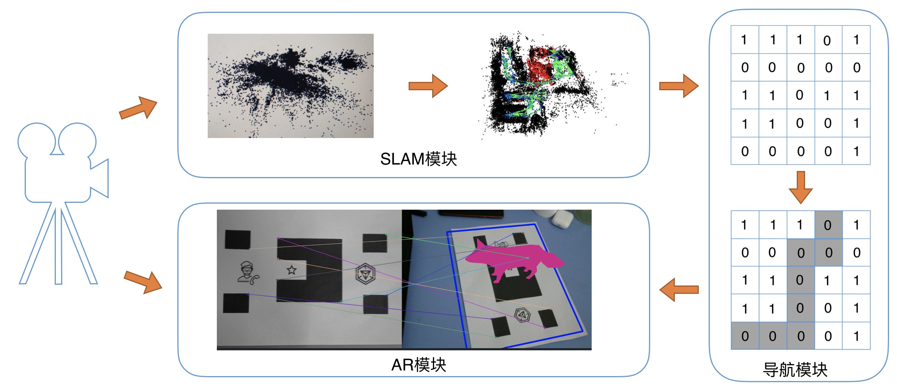
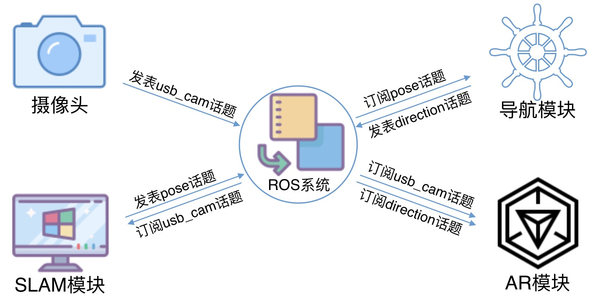

# Indoor-Navigation-System
Indoor Navigation System based on SLAM &amp; AR
## Abstract
   With the continuous development of society, the environmental information of some realistic scenes such as movie theaters, squares, etc. is becoming more and more complicated, making us sometimes spend a lot of time to find a destination. Although navigation systems have been widely used in outdoor environments today, due to the attenuation of satellite signals in indoor environments, GPS accuracy in indoor environments often fails to meet the requirements, and common navigation software is not ideal for indoor navigation. In recent years, computer vision technologies such as SLAM have made great progress, making it possible to build environmental maps. The continuous innovation of augmented reality technology has also greatly reduced the cost of understanding. This project aims to use SLAM technology to model maps of a more complex indoor environment, build an overall map, use global search routes for route planning, and finally use augmented reality technology to assist guidance to save users navigation time and promote indoor navigation technology.

The research object of this article is the indoor navigation system, the main research content is: 

(1) use SLAM technology for map modeling, real-time display of pose, and the ROS system is used for the image and pose information transmission between each module;
 
(2) in the SLAM module After generating a 3D point cloud, align it with the actual map and convert it into a topology map;
 
(3) Implement a map navigation module to compare the time and space complexity of each search algorithm; 

(4) Use OpenGL to draw an electronic map, the current position and The navigation route is displayed on the electronic map in real time; 

(5) The AR module is used for auxiliary guidance. After testing, the functions such as system construction and navigation can be used normally to meet the basic needs of indoor navigation.
## Keywords
**Indoor Navigation**; **Simultaneous Localization and Mapping**; **Augmented Reality.**

## Base

SLAM module：https://github.com/Alkaid-Benetnash/ORB_SLAM2

AR module：https://github.com/juangallostra/augmented-reality

## Goal

本项目旨在设计一个室内导航系统，让用户在一些复杂的室内环境中快捷方 便的到达目的地，同时也弥补传统导航软件在室内导航的不足之处。

下面详细介绍系统要求: 
1.电子地图显示。展示当前环境小地图，在小地图上用户可以看到目前所在位置 和导航路线结果。
 2.实时定位。系统可以实时的准确获取用户当前位置，并在小地图中展示。
  3.导航系统完备。在获取目的地信息后，系统可以给出正确的导航路线，路线长 度尽可能短，导航结果显示在小地图中。 
  4.增强现实指引。在主要利用小地图导航的前提下，利用增强现实技术辅助指引。
   5.系统鲁棒性和可持续运行。

## structure

系统包括AR模块，导航模块和SLAM模块。
## Data transmission method

由于系统使用多线程执行和多语言编写，系统内部信息传递较为复杂，设计 各模块信息传递利用 ROS 系统，通过发表、订阅话题的方式进行。

具体方式见上图，摄像头在实时获取图像后，在 ROS 系统上发布 usb_cam 话题，SLAM模块和AR 模块对该话题进行订阅，图像信息便传递到了 SLAM 模块 和 AR 模块;SLAM 模块在获取图像信息后，实时计算出用户当前位姿信息，将其 作为 pose 话题发表在 ROS 系统中，导航模块则订阅 pose 话题，以当前位置作为 导航路线的起点;导航模块确定导航路线后，将用户下一步方向发表在 ROS 系统 上，AR 模块订阅后进行辅助指引。

## 
